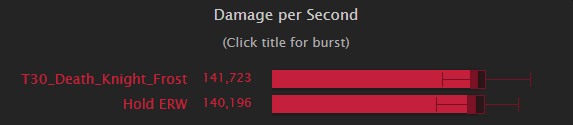
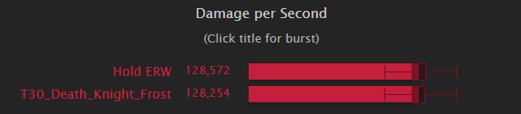
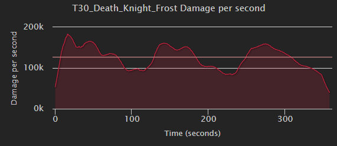

import React, { useEffect } from 'react';

export const Wowhead = () => {
  useEffect(() => {
    // Create a script element for the inline script
    const inlineScript = document.createElement('script');
    inlineScript.innerHTML = 'const whTooltips = {colorLinks: true, iconizeLinks: true, renameLinks: true};';
    document.body.appendChild(inlineScript);

    // Create a script element for the external script
    const externalScript = document.createElement('script');
    externalScript.src = 'https://wow.zamimg.com/js/tooltips.js';
    document.body.appendChild(externalScript);

    // Clean up the scripts when the component is unmounted
    return () => {
      document.body.removeChild(inlineScript);
      document.body.removeChild(externalScript);
      console.log('unmounted')
    };
  }, []);

  return (
    <>
    </>
  );
};

<Wowhead />
# 10.1 Breath of Sindragosa Guide for Frost Death Knights
By Khazakdk

## Introduction
### Who is this guide for?
This guide is targeted towards players who are newer to the spec or long time Frost players who have avoided the Breath of Sindragosa build.

### What does this guide cover?
This guide will primarily focus on <a href="https://wowhead.com/spell=152279">Breath of Sindragosa</a> gameplay, with smaller portions focused on gear and talents.  Other guides and resources sufficiently cover those subjects.  My main focus here will be teaching how to play the spec in PvE content with the aim of reducing some misconceptions about the builds.  Many players feel that BoS is either a 1 button playstyle that is too boring or is too punishing on the player for dealing with mechanics.  

### Who am I?
I am Khazak, a Death Knight main since I started playing in 5.4.  My notable contributions include working on the DK simc module, writing the Frost and Unholy modules for WoWAnalyzer, and helping in Acherus.     

---
## Talents
### Death Knight class talents
<a href="https://www.wowhead.com/talent-calc/embed/death-knight/frost/DAPFVBEBSEVBEFEhqUAAA">talent calc</a>
This is the standard class tree for Frost in the vast majority of raid content.  In order to path to all the throughput we will lose nearly all flexibility in the class tree.  However, if there is little magic damage then we can drop <a href="https://wowhead.com/spell=51052">Anti-Magic Zone</a> and <a href="https://wowhead.com/spell=374383">Assimilation</a> for alternatives.

- <a href="https://wowhead.com/spell=207167">Blinding Sleet</a> is a good pickup in all keys, and can be taken in raid if the fight calls for it.
- <a href="https://wowhead.com/spell=378848">Coldthirst</a> provides us a small amount of throughput and is the first swap to look to take if <a href="https://wowhead.com/spell=51052">Anti-Magic Zone</a> provides no value.
- <a href="https://wowhead.com/spell=374277">Improved Death Strike</a> is very strong in the right situations.  It’s primary benefit to Frost is the RP cost reduction.  Not to say that the extra healing is bad, but because <a href="https://wowhead.com/spell=49998">Death Strike</a>'s healing is 25% of your recently taken damage, adding 60% of 25% damage taken ends up being underwhelming most of the time.  Because of this, <a href="https://wowhead.com/spell=374277">Improved Death Strike</a> will primarily be beneficial in M+, where it is more likely that both <a href="https://wowhead.com/spell=51052">Anti-Magic Zone</a> will be less valuable, and that the saved RP will add up to a significant amount over the course of the key.

With these points considered, this would be a good general class tree to take into keys
<a href="https://www.wowhead.com/talent-calc/embed/death-knight/frost/DAPFVVEBSERBAFEhqUAAA">talent calc</a>

### Frost spec talents
<a href="https://www.wowhead.com/talent-calc/embed/death-knight/frost/DBAAAXIIOIDIMIDIKIFIBIGIFDFICDDGBIHIEDFDFIGGFDBIQIQDBhVBA">talent calc</a>
Like the class tree, pathing to the mandatory talents severely restricts options.  The talents marked in green are build defining talents that cannot be dropped.  <a href="https://wowhead.com/spell=207167">Murdereous Efficiency</a> generates too many resources to ever consider dropping.  <a href="https://wowhead.com/spell=51271">Pillar of Frost</a> and <a href="https://wowhead.com/spell=207126">Icecap</a> are the primary damage amplifiers, and thus cannot be dropped.  <a href="https://wowhead.com/spell=207142">Avalanche</a> gives <a href="https://wowhead.com/spell=53343">Rune of Razorice</a> for free, enabling <a href="https://wowhead.com/spell=326911">Rune of Hysteria</a> to go on a weapon instead.  <a href="https://wowhead.com/spell=152279">Breath of Sindragosa</a> is of course mandatory as the namesake of the build.  This leaves 3 points to play with, <a href="https://wowhead.com/spell=405166">Fatal Fixation</a>, and 2/2 <a href="https://wowhead.com/spell=377098">Bonegrinder</a>.
- <a href="https://wowhead.com/spell=305392">Chill Streak</a> (optionally with <a href="https://wowhead.com/spell=207167">Enduring Chill</a>).  In two target content, this is hands down the best talent.  But, there is a lack of 2T content available to right now.  <a href="https://wowhead.com/spell=279302">Frostwyrm’s Fury</a> will scale better into higher target counts, and <a href="https://wowhead.com/spell=305392">Chill Streak</a> is useless in single target.  An argument can be made to take this into keys with small pulls, but be aware it will not help you on bosses.
- <a href="https://wowhead.com/spell=377226">Frostwhelp’s Aid</a>.  Very solid pick if you can hit 4-5 targets with each <a href="https://wowhead.com/spell=51271">Pillar of Frost</a>.  
- <a href="https://wowhead.com/spell=279302">Frostwyrm’s Fury</a> and <a href="https://wowhead.com/spell=377047">Absolute Zero</a>.  One point into FWF is better than 2/2 <a href="https://wowhead.com/spell=377098">Bonegrinder</a> in any multi target content.  With the 10.1 set bonus, this talent package stands out above the other optional talents. 
- 2/2 <a href="https://wowhead.com/spell=377098">Bonegrinder</a>.  <a href="https://wowhead.com/spell=377098">Bonegrinder</a> is mainly a one point wonder, as the crit effect does not scale with points spent, only the frost damage does.  Putting two points into it is something only done for pure single target, where the talents emphasizing hitting multiple targets will of course not do much.
- <a href="https://wowhead.com/spell=405166">Fatal Fixation</a> In high target count AoE situations, this talent will have less impact and can be dropped for something else.  

Considering these points, a build for something like Brackenhide Hollow would drop to 1/2 <a href="https://wowhead.com/spell=377098">Bonegrinder</a> and drop <a href="https://wowhead.com/spell=405166">Fatal Fixation</a> to take <a href="https://wowhead.com/spell=207167">Frostwyrm's Fury</a> and <a href="https://wowhead.com/spell=377047">Absolute Zero</a>.  

---
## Why play Breath?
Breath’s uniqueness comes from its dynamic gameplay.  Instead of being a scripted cooldown, your rotation priority changes based on your resources while BoS is rolling.  The goal during BoS is to extend it as long as possible without otherwise sacrificing throughput.  This is done by generating Runic Power as efficiently as possible, which is done by managing Runes well.  The dynamic element is primarily enabled by the passive Runic Empowerment giving BoS a powerful feedback loop.  By spending Runic Power off the gcd, BoS is able to significantly increase its Rune regeneration rate, which will in turn generate more Runic Power to fuel BoS.  However, Runic Empowerment's random nature requires players to quickly evaluate the state of their resources and make a decision.  BoS is also able to freely cleave onto other targets while not sacrificing any priority target damage, something that is typically very valuable in progression raiding.   

## Why not to play Breath?

Breath is currently in something of an identity crisis.  For years it performed at its best when it lasted 25-45 seconds.  Having a high impact 2 minute cooldown with a dynamic playstyle attracted players to the spec as it enabled an interesting playstyle where players could look at a fight and figure out when to most effectively use cooldowns.  Currently, BoS does not fit that identity.  It is a spec that demands constant uptime, using CDs almost as soon as you can, and has one of the highest amounts of RNG of all the DPS specs.  This makes BoS often feel out of the player’s control, which most players find frustrating.     

---
## Abilities and Rotation
### Priority list inside BoS
- <a href="https://wowhead.com/spell=196770">Remorseless Winter</a>
- <a href="https://wowhead.com/spell=49184">Howling Blast</a> with <a href="https://wowhead.com/spell=59057">Rime</a> if RP > 47 OR RP > 39 with <a href="https://wowhead.com/spell=377076">Rage of the Frozen Champion</a>
- <a href="https://wowhead.com/spell=57330">Horn of Winter</a> if you have less than 2 Runes and will not waste RP
- <a href="https://wowhead.com/spell=49020">Obliterate</a> if <a href="https://wowhead.com/spell=51271">Pillar of Frost</a> is up
- <a href="https://wowhead.com/spell=49020">Obliterate</a> if at max <a href="https://wowhead.com/spell=51128">Killing Machine</a> stacks
- <a href="https://wowhead.com/spell=49020">Obliterate</a> if RP will not be wasted
- <a href="https://wowhead.com/spell=49184">Howling Blast</a> or if you have 1 rune and less than 38 rp (This gives one extra tick and is a very minor optimization)
### Priority list outside BoS
- <a href="https://wowhead.com/spell=49143">Frost Strike</a> to maintain <a href="https://wowhead.com/spell=194878">Icy Talons</a>/<a href="https://wowhead.com/spell=376905">Unleashed Frenzy</a>
- <a href="https://wowhead.com/spell=196770">Remorseless Winter</a>
- <a href="https://wowhead.com/spell=49143">Frost Strike</a> if not at max <a href="https://wowhead.com/spell=51128">Killing Machine</a> stacks
- <a href="https://wowhead.com/spell=59057">Rime</a> if not at max <a href="https://wowhead.com/spell=51128">Killing Machine</a> stacks
- <a href="https://wowhead.com/spell=49020">Obliterate</a> with <a href="https://wowhead.com/spell=51128">Killing Machine</a>
- <a href="https://wowhead.com/spell=49020">Obliterate</a>
- <a href="https://wowhead.com/spell=49143">Frost Strike</a>

---
## Resource Cooldowns
Frost has 4 major resource cooldowns: <a href="https://wowhead.com/spell=47568">Empower Rune Weapon</a>, <a href="https://wowhead.com/spell=57330">Horn of Winter</a>, <a href="https://wowhead.com/spell=48707">Anti-Magic Shell</a>, and <a href="https://wowhead.com/spell=51052">Anti-Magic Zone</a> (with <a href="https://wowhead.com/spell=374383">Assimilation</a>).  Understanding when to use them so as to not waste any of them is key to doing well on breath.
- <a href="https://wowhead.com/spell=57330">Horn of Winter</a> is the simplest.  While <a href="https://wowhead.com/spell=152279">Breath of Sindragosa</a> is active, you use it while you have no other Runic Power generating abilities to use on that GCD, i.e. you cannot press Obliterate due to lack of Runes and you have no Rime procs to consume with RotFC.  While it is a strong button, it's immediate impact is relatively low since it does no damage by itself and does not spend Runes to contribute to <a href="https://wowhead.com/spell=194192">Gathering Storm</a> or <a href="https://wowhead.com/spell=51271">Pillar of Frost</a> stacks.
- Next easiest is <a href="https://wowhead.com/spell=51052">Anti-Magic Zone</a>, as this is usually assigned by healers.  If not assigned, you want to use it when your raid will take enough magic damage to use most of the AMZ.  If given the choice of multiple points where this is true, then pick the spot that best matches where your resources will hit a lull.  For example, on Mythic Raszageth it was usually best to <a href="https://wowhead.com/spell=51052">Anti-Magic Zone</a> on the second Hurricane Wing cast around 1:15 as the first cast would often cause RP to overcap and the third cast would require using another resource cooldown early.  
- <a href="https://wowhead.com/spell=48707">Anti-Magic Shell</a> is usually straightforward to use.  To properly use it, you need to have some knowledge of what mechanics in the fight do magic damage.  The goal is to use <a href="https://wowhead.com/spell=48707">Anti-Magic Shell</a> close to off cooldown so as to not lose casts, but also make sure the the absorb is utilized.  For the last 2 tiers content heavy in magic damage occurs more often than not so it has become expected to get a full use out of <a href="https://wowhead.com/spell=48707">Anti-Magic Shell</a> in most situations.  However, getting a good use requires that the damage intake is high enough and this is not the case in lower keys or Heroic and lower raids.  
- Lastly, <a href="https://wowhead.com/spell=47568">Empower Rune Weapon</a>.  This is the hardest cooldown to pin down exactly when to use.  While the resources this grants are nice, its main benefit is the haste.  To put it into context, if Runic Power is low, <a href="https://wowhead.com/spell=47568">Empower Rune Weapon</a> is just 15 RP on activation with another 15 RP on the next tick in 5 seconds.  Because of this, <a href="https://wowhead.com/spell=47568">Empower Rune Weapon</a> should be used a bit before resources start to really run dry.  The sim derived answer to when to use <a href="https://wowhead.com/spell=47568">Empower Rune Weapon</a> is with less than 70 RP and less than 3 Runes.  However, some fights have predictable moments of heavy movement or mechanical focus that prevent you from tunneling.  In those situations, it is often advantageous to hold <a href="https://wowhead.com/spell=47568">Empower Rune Weapon</a> and use it shortly before the mechanic to bolster resources.  My advice would be to start with the sim timings, and then adjust <a href="https://wowhead.com/spell=47568">Empower Rune Weapon</a> at particular sticking point.  Or, to look at some logs beforehand with a tool like lorrgs.io.  The proceeding advice is great for one charge, but about two charges?  In most situations, you should be using your first <a href="https://wowhead.com/spell=47568">Empower Rune Weapon</a> with your first Pillar/Breath on pull with Bloodlust.  Stacking haste cooldowns is quite potent, and it is better in the majority of situations to take consistently higher opener bursts than to try and sit on <a href="https://wowhead.com/spell=47568">Empower Rune Weapon</a> and desync its cooldown.

  
For those interested, click this section to see a compilation of sims exploring ERW usage

  | Lust + AMS/AMZ RP |
  | :----------------------: |
  |  |
  |  | Damage curve for default APL |   
  |  | Damage curve for APL holding ERW |

  There’s an obvious difference here.  Holding ERW is causing a noticeable dip in the burst peak at the start of the fight.  Stacking haste buffs is very potent, as anyone who’s played Unholy is aware and the same applies to frost.  The extra haste in the lust window lets you cycle more GCDs in your pillar to stack it higher, and makes rolling your GS stacks into a new RW more consistent.

  | No Lust + AMS/AMZ RP |
  | :----------------------: |
  |  |
  |  | Damage curve for default APL |   
  |  | Damage curve for APL holding ERW |
    

  Without lust on pull, the difference becomes slight.  This would line up with a fight like Echo of Neltharion, where between the unlusted pull and frequent movement, you would want to save ERW.

  | No Lust + No AMS/AMZ RP |
  | :----------------------: |
  |  |
  |  | Damage curve for default APL |   
  |  | Damage curve for APL holding ERW |

  Almost not worth discussing this, I have included just to show the opposite of the claim, that without lust it is not worth using ERW early.

  | Lust + No AMS/AMZ RP |
  | :----------------------: |
  |  |
  |  | Damage curve for default APL |   
  |  | Damage curve for APL holding ERW |

  One final example just to emphasize that most of the gain is from stacking haste cooldowns.

## Stats
Before going any further, SIM YOURSELF.  Numerous factors go into the value of each stat and trying to come up with a value is best left to using a computer to solve for each particular situation.  Sometimes a general trend can be found, but this is not always the case.  I will give the stats in no particular order 
#### Mastery
Simply increases our frost damage done.  This only affects spells specific to us and will not increase frost damage from items or other effects that originate outside of the spec itself.  It is often a better stat to pick up in AoE since our primary multi target spells are frost damage.  We prefer mastery to versatility because of how mastery points work.  It takes 180 mastery rating to gain 1 mastery point, which converts to 2% mastery on your sheet.  Versatility takes 205 rating to gain 1% damage.
#### Critical Strike
Does what it says on the tin but has some extra benefits for Frost.  It’s primary extra benefit is more crit gives more Killing Machine procs, and this means more chances for Murderous Efficiency procs for Runes.  In Aberrus, the tier set amplifies our crits making it more valuable than it already was.  This makes BoS build tend to want as much crit as it can get.
#### Haste
Speeds up your auto attacks, GCD, and Rune regeneration rate.  The primary benefit you will see is the sped up GCD.  Rune regeneration is determined by (10 / 1 + haste).  So with 10% haste we get a rune cooldown of (10 / 1 + .10) = 9.09s.  This same formula governs GCD however.  As we get Runes back faster, we can spend them faster.  To illustrate this, I ran two sims, one with 1000 haste and one with 6000 
Can you guess which one has 6000?  Its the first one.  Being able to cycle resources so quickly leads to a lot of waiting from either being out of runes or full on RP.  This point isn’t to dissuade or downplay haste, just to dispel the rumor that DK has a lot of downtime without haste.  Haste’s main benefit to Frost is the faster GCD.  I want to highlight two main benefits from this.  First, it stacks Pillar of Frost’s strength bonus higher and builds Enduring Strength.  The other is it builds GS stacks faster and increases our ability to carryover stacks to the next cast of RW.  

#### Versatility
Not much to stay here.  It’s a boring and expensive stat.

## Gearing
Sim yourself.  All gearing can and should be handled by using Top Gear and Droptimizer to see what’s going to be good for your specific character.  I will briefly cover what you’re looking for in terms of crafting your sparks and if you need to insist on anything being good for you to your loot council:
Craft boots and belt, put shadowflame patch on them.
Craft weapon
Craft ring

Class trinket and OCE are very good for us.

## Consumes
Phial of Corrupting Rage is incredibly good for us.  Do not let your healers bully you into vers.  Dropping this Phial would like taking off a mythic ilvl weapon and replacing it with a normal ilvl weapon.  Buzzing Rune for your temporary enchant.  Sim yourself for gems and enchants.  Runeforges are Fallen Crusader and Hysteria.  
  
