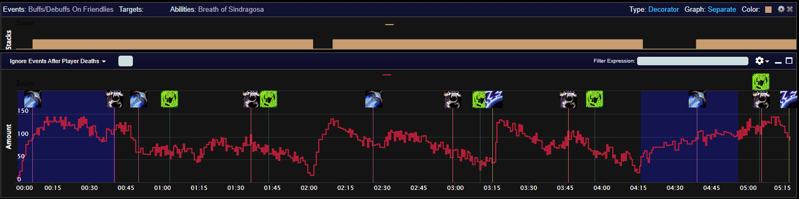
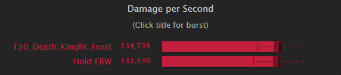

# 10.2 Breath of Sindragosa Guide for Frost Death Knights
By Khazakdk


## Introduction
### Who is this guide for?
This guide is targeted toward players who are newer to the spec or long-time Frost players who have avoided the Breath of Sindragosa build.

### What does this guide cover?
This guide will primarily focus on <a href="https://wowhead.com/spell=152279">Breath of Sindragosa</a> gameplay, with smaller portions focused on gear and talents.  Other guides and resources sufficiently cover those subjects.  My main focus here will be teaching how to play the spec in PvE content to reduce some misconceptions about the builds.  Many players feel that BoS is either a 1 button playstyle that is too boring or is too punishing for the player to deal with mechanics.  

### Who am I?
I am Khazak, a Death Knight main since I started playing in 5.4.  My notable contributions include working on the DK simc module, writing the Frost and Unholy modules for WoWAnalyzer, and helping in Acherus.     

---
## Talents
### Death Knight class talents
<a href="https://www.wowhead.com/talent-calc/embed/death-knight/frost/DBaCCLDECFEFDGEDEHCCEFEFDGDDDDDIEDDFEGDHDSDGDDDDDIDDDDDAAAAA">talent calc</a>
Nodes that give offensive throughput value are marked in green, significant defensive nodes are marked in blue, and the nodes taken to unlock the bottom rows are white.  To path to all the throughput, we will lose nearly all flexibility in the class tree.  However, if there is little magic damage then we can drop <a href="https://wowhead.com/spell=51052">Anti-Magic Zone</a> and <a href="https://wowhead.com/spell=374383">Assimilation</a> for alternatives.

- <a href="https://www.wowhead.com/spell=207167">Blinding Sleet</a> is a solid AoE stop and should be taken by default in M+ content.  In raid content <a href="https://www.wowhead.com/spell=207167">Blinding Sleet</a> is often not needed and can be dropped for something else.
- <a href="https://wowhead.com/spell=374277">Improved Death Strike</a> is very strong in the right situations.  Its primary benefit to Frost is the RP cost reduction.  Not to say that the extra healing is bad, but because <a href="https://wowhead.com/spell=49998">Death Strike</a>'s healing is 25% of your recently taken damage, adding 60% of 25% damage taken ends up being underwhelming most of the time.  Because of this, <a href="https://wowhead.com/spell=374277">Improved Death Strike</a> will primarily be beneficial in M+, where it is more likely that both <a href="https://wowhead.com/spell=51052">Anti-Magic Zone</a> will be less valuable, and that the saved RP will add up to a significant amount throughout the key.
- <a href="https://www.wowhead.com/spell=378848">Coldthirst</a> comes with the caveat that constant interrupts need to be available for this to be justified.  In raid content, this will usually not be the case.  Look at this in M+ for keys that offer multiple interrupts per minute.
- <a href="https://www.wowhead.com/spell=391546">March of Darkness</a> is a cheap mobility boost.  If you do not need anything else, this is a good point to default to.
- <a href="https://www.wowhead.com/spell=221562">Asphyxiate</a> is unfortunately hard to justify taking as other classes have better access to stuns but if you really need a stun and don't have a use for <a href="https://wowhead.com/spell=51052">Anti-Magic Zone</a> then it's there.  
- If you are in pure single target, you can take <a href="https://www.wowhead.com/spell=343294">Soul Reaper</a> instead of <a href="https://www.wowhead.com/spell=383269">Abomination Limb</a>

### Frost spec talents
<a href="https://www.wowhead.com/talent-calc/embed/death-knight/frost/DBAAAbICOCDCMCDCKCFCBCGCFDFCCDDGBCDCBDBCBDCCFDDDBCGGFDBCQCQDBhVBA">talent calc</a>
Like the class tree, pathing to the mandatory talents severely restricts options.  The talents marked in green are build-defining talents that cannot be dropped.  <a href="https://wowhead.com/spell=207061">Murderous Efficiency</a> generates too many resources to ever consider dropping.  <a href="https://wowhead.com/spell=51271">Pillar of Frost</a> and <a href="https://wowhead.com/spell=207126">Icecap</a> are the primary damage amplifiers, and thus cannot be dropped.  <a href="https://wowhead.com/spell=207142">Avalanche</a> gives <a href="https://wowhead.com/spell=53343">Rune of Razorice</a> for free, enabling <a href="https://wowhead.com/spell=326911">Rune of Hysteria</a> to go on a weapon instead.  <a href="https://wowhead.com/spell=152279">Breath of Sindragosa</a> is, of course, mandatory as the namesake of the build.  <a href="https://wowhead.com/spell=305392">Chill Streak</a> is a must-pick because our tier bonus is useless without it.  This leaves Frost very few points to play with.  Depending on the situation Frost will usually trade off the following: <a href="https://wowhead.com/spell=405166">Fatal Fixation</a>, <a href="https://wowhead.com/spell=377190">Enduring Strength</a>, and 2/2 <a href="https://wowhead.com/spell=377098">Bonegrinder</a>.

- <a href="https://wowhead.com/spell=377226">Frostwhelp’s Aid</a> is a solid pick if you can hit 4-5 targets with each <a href="https://wowhead.com/spell=51271">Pillar of Frost</a>.  
- <a href="https://wowhead.com/spell=377190">Enduring Strength</a> can be traded out when taking <a href="https://wowhead.com/spell=377226">Frostwhelp’s Aid</a> to unlock <a href="https://wowhead.com/spell=207126">Icecap</a>.  Most often this will happen in keys. 
- <a href="https://wowhead.com/spell=279302">Frostwyrm’s Fury</a> and <a href="https://wowhead.com/spell=377047">Absolute Zero</a>.  One point into FWF is better than 2/2 <a href="https://wowhead.com/spell=377098">Bonegrinder</a> in any multi-target content.  With the 10.2 locking Frost into <a href="https://wowhead.com/spell=305392">Chill Streak</a>, it is difficult to justify taking <a href="https://wowhead.com/spell=377047">Absolute Zero</a>. 
- 2/2 <a href="https://wowhead.com/spell=377098">Bonegrinder</a> is mainly a one-point wonder, as the crit effect does not scale with points spent, only the frost damage does.  Putting two points into it is something only done for purely single-target content, when the AoE-focused talents will not have a chance to provide value.
- <a href="https://wowhead.com/spell=405166">Fatal Fixation</a> will have less impact in high target count AoE situations and can be dropped for something else.  
- <a href="https://wowhead.com/spell=377376">Enduring Chill</a> unfortunately struggles to find a place.  There are few flexible points, and this just falls behind the alternatives.

#### Default Raid build
<a href="https://www.wowhead.com/talent-calc/embed/death-knight/frost/DAPFVBEBSEVBEFEhqRANVVJRFGFUVEYIEBQ">Raid talent calc</a>

#### Default M+ build
For those playing <a href="https://wowhead.com/spell=152279">Breath of Sindragosa</a> in M+, good luck.  It is difficult to get a good performance without a coordinated group that plans for specific big pulls.  For those that want to try, here is the highest simming build in DungeonSlice as a starting point.  Yes, you take <a href="https://www.wowhead.com/spell=194913">Glacial Advance</a>.  Use it when outside of CDs.
<a href="https://www.wowhead.com/talent-calc/embed/death-knight/frost/DAPFVRFBSERBAFEhqUANVVJVFEhUVEYIEBQ">M+ talent calc</a>

---
## Why Play Breath?
Breath’s uniqueness comes from its dynamic gameplay.  Instead of being a scripted cooldown, your rotation priority changes based on your resources while BoS is rolling.  The goal during BoS is to extend it as long as possible without otherwise sacrificing throughput.  This is done by generating Runic Power as efficiently as possible, which is done by managing Runes well.  The dynamic element is primarily enabled by the passive Runic Empowerment giving BoS a powerful feedback loop.  By spending Runic Power off the gcd, BoS can significantly increase its Rune regeneration rate, which will in turn generate more Runic Power to fuel BoS.  However, Runic Empowerment's random nature requires players to quickly evaluate the state of their resources and make a decision.  BoS is also able to freely cleave onto other targets while not sacrificing any priority target damage, something that is typically very valuable in progression raiding.   

## Why Not to Play Breath?

Breath is currently in something of an identity crisis.  For years it performed at its best when it lasted 25-45 seconds.  Having a high-impact 2-minute cooldown with a dynamic playstyle attracted players to the spec as it enabled an interesting playstyle where players could look at a fight and figure out when to most effectively use cooldowns.  Currently, BoS does not fit that identity.  It is a spec that demands constant uptime, using CDs almost as soon as you can, and has one of the highest amounts of RNG of all the DPS specs.  This makes BoS often feel out of the player’s control, which most players find frustrating.     

---
## Abilities and Rotation
### High Priority things to do at all times
- <a href="https://www.wowhead.com/spell=343294">Soul Reaper</a> when the target will be under 35% HP when the debuff expires and if <a href="https://wowhead.com/spell=152279">Breath of Sindragosa</a> is active you have 40+ RP
- Maintain <a href="https://wowhead.com/spell=194878">Icy Talons</a>/<a href="https://wowhead.com/spell=376905">Unleashed Frenzy</a> 
- <a href="https://wowhead.com/spell=196770">Remorseless Winter</a> off CD if <a href="https://wowhead.com/spell=194912">Gathering Storm</a> is talented (It will be in 10.2)
- <a href="https://www.wowhead.com/spell=305392">Chill Streak</a> when it is available

### Priority list inside <a href="https://wowhead.com/spell=152279">Breath of Sindragosa</a>
- <a href="https://wowhead.com/spell=49184">Howling Blast</a> with <a href="https://wowhead.com/spell=59057">Rime</a> if RP > 47 OR RP > 39 with <a href="https://wowhead.com/spell=377076">Rage of the Frozen Champion</a>
- <a href="https://wowhead.com/spell=57330">Horn of Winter</a> if you have less than 2 Runes and will not waste RP
- <a href="https://www.wowhead.com/spell=43265">Death and Decay</a> with <a href="https://wowhead.com/spell=316916">Cleaving Strikes</a> talented if hitting 2+ targets and <a href="https://wowhead.com/spell=51271">Pillar of Frost</a> is active
- <a href="https://wowhead.com/spell=49020">Obliterate</a> if <a href="https://wowhead.com/spell=51271">Pillar of Frost</a> is active
- <a href="https://wowhead.com/spell=49020">Obliterate</a> if at max <a href="https://wowhead.com/spell=51128">Killing Machine</a> stacks
- <a href="https://wowhead.com/spell=49020">Obliterate</a> if RP will not be wasted
- <a href="https://wowhead.com/spell=49184">Howling Blast</a> if you have 1 rune and less than 38 rp (This gives one extra tick and is a very minor optimization)
### Priority list outside <a href="https://wowhead.com/spell=152279">Breath of Sindragosa</a>
- <a href="https://wowhead.com/spell=49143">Frost Strike</a> if not at max <a href="https://wowhead.com/spell=51128">Killing Machine</a> stacks
- <a href="https://wowhead.com/spell=49184">Howling Blast</a> with <a href="https://wowhead.com/spell=59057">Rime</a> if not at max <a href="https://wowhead.com/spell=51128">Killing Machine</a> stacks
- <a href="https://www.wowhead.com/spell=43265">Death and Decay</a> with <a href="https://wowhead.com/spell=316916">Cleaving Strikes</a> talented if hitting 2+ targets and <a href="https://wowhead.com/spell=51271">Pillar of Frost</a> is active
- <a href="https://wowhead.com/spell=49020">Obliterate</a> with <a href="https://wowhead.com/spell=51128">Killing Machine</a>
- <a href="https://wowhead.com/spell=49020">Obliterate</a>
- <a href="https://wowhead.com/spell=49143">Frost Strike</a>

---
## Resource Cooldowns
Frost has 4 major resource cooldowns: <a href="https://wowhead.com/spell=47568">Empower Rune Weapon</a>, <a href="https://wowhead.com/spell=57330">Horn of Winter</a>, <a href="https://wowhead.com/spell=48707">Anti-Magic Shell</a>, and <a href="https://wowhead.com/spell=51052">Anti-Magic Zone</a> (with <a href="https://wowhead.com/spell=374383">Assimilation</a>).  Understanding when to use them to not waste any of them is key to doing well on <a href="https://wowhead.com/spell=152279">Breath of Sindragosa</a>.
- <a href="https://wowhead.com/spell=57330">Horn of Winter</a> is the simplest.  While <a href="https://wowhead.com/spell=152279">Breath of Sindragosa</a> is active, you use it while you have no other Runic Power generating abilities to use on that GCD, i.e. you cannot press Obliterate due to lack of Runes and you have no Rime procs to consume with RotFC.  While it is a strong button, its immediate impact is relatively low since it does no damage by itself and does not spend Runes to contribute to <a href="https://wowhead.com/spell=194912">Gathering Storm</a> or <a href="https://wowhead.com/spell=51271">Pillar of Frost</a> stacks.
- Next easiest is <a href="https://wowhead.com/spell=51052">Anti-Magic Zone</a>, as this is usually assigned by healers.  If not assigned, you want to use it when your raid will take enough magic damage to use most of the AMZ.  If given the choice of multiple points where this is true, then pick the spot that best matches where your resources will hit a lull.  For example, on Mythic Raszageth it was usually best to <a href="https://wowhead.com/spell=51052">Anti-Magic Zone</a> on the second Hurricane Wing cast around 1:15 as the first cast would often cause RP to be wasted and the third cast would require using another resource cooldown early.  
- <a href="https://wowhead.com/spell=48707">Anti-Magic Shell</a> is usually straightforward to use.  To properly use it, you need to have some knowledge of what mechanics in the fight do magic damage.  The goal is to use <a href="https://wowhead.com/spell=48707">Anti-Magic Shell</a> close to off cooldown to not lose casts, but also make sure the absorb is utilized.  For the last 2 tiers content heavy in magic damage occurs more often than not so it has become expected to get a full use out of <a href="https://wowhead.com/spell=48707">Anti-Magic Shell</a> in most situations.  However, getting a good use requires that the damage intake is high enough and this is not the case in lower keys or Heroic and lower raids.  
- Lastly, <a href="https://wowhead.com/spell=47568">Empower Rune Weapon</a>.  This is the hardest cooldown to pin down exactly when to use.  While the resources this grants are nice, its main benefit is the haste.  To put it into context, if Runic Power is low, <a href="https://wowhead.com/spell=47568">Empower Rune Weapon</a> is just 15 RP on activation with another 15 RP on the next tick in 5 seconds.  Because of this, <a href="https://wowhead.com/spell=47568">Empower Rune Weapon</a> should be used a bit before resources start to really run dry.  The sim-derived answer to when to use <a href="https://wowhead.com/spell=47568">Empower Rune Weapon</a> is with less than 70 RP and less than 3 Runes.  However, some fights have predictable moments of heavy movement or mechanical focus that prevent you from tunneling.  In those situations, it is often advantageous to hold <a href="https://wowhead.com/spell=47568">Empower Rune Weapon</a> and use it shortly before the mechanic to bolster resources.  My advice would be to start with the sim timings, and then adjust <a href="https://wowhead.com/spell=47568">Empower Rune Weapon</a> at a particular sticking point.  Or, to look at some logs beforehand with a tool like <a href="https://lorrgs.io/spec_ranking/deathknight-frost/kazzara-the-hellforged">lorrgs.io</a>.  The proceeding advice is great for one charge, but about two charges?  In most situations, you should be using your first <a href="https://wowhead.com/spell=47568">Empower Rune Weapon</a> with your first Pillar/Breath on pull with Bloodlust.  Stacking haste cooldowns is quite potent, and it is better in the majority of situations to take consistently higher opener bursts than to try and sit on <a href="https://wowhead.com/spell=47568">Empower Rune Weapon</a> and desync its cooldown.  The <a href="https://www.wowhead.com/item-set=1557">T31</a> set makes Frost always want to use <a href="https://wowhead.com/spell=47568">Empower Rune Weapon</a> on pull so that the CDR effect is not wasted.

To tie all that together, I have annotated some graphs from Warcraft Logs showing <a href="https://wowhead.com/spell=152279">Breath of Sindragosa</a> uptime along with Runic Power throughout the fight.  The important takeaway from this aid is to know the importance of spacing out the resource cooldowns to avoid wasting Runic Power.


<details>
  <summary>For those interested, click this section to see a compilation of sims exploring ERW usage</summary>

  | Lust + AMS/AMZ RP |
  | :----------------------: |
  |  |
  |  |   
  |  |

  There’s an obvious difference here.  Holding ERW is causing a noticeable dip in the burst peak at the start of the fight.  Stacking haste buffs is very potent, as anyone who’s played Unholy is aware and the same applies to frost.  The extra haste in the lust window lets you cycle more GCDs in your pillar to stack it higher and makes rolling your GS stacks into a new RW more consistent.

  | No Lust + AMS/AMZ RP |
  | :----------------------: |
  |  |
  |  |  |   
  |  |  |
    

  Without lust on pull, the difference becomes slight.  This would line up with a fight like Echo of Neltharion, where between the unlusted pull and frequent movement, you would want to save ERW.

  | No Lust + No AMS/AMZ RP |
  | :----------------------: |
  |  |
  |  | 
  |  | 


  Almost not worth discussing this, I have included it just to show the opposite of the claim, that without lust it is not worth using ERW early.

  | Lust + No AMS/AMZ RP |
  | :----------------------: |
  |  |
  |  | 
  |  | 


  One final example to emphasize that most of the gain is from stacking haste cooldowns.
</details>


## Stats
Before going any further, **sim yourself**.  Numerous factors go into the value of each stat and trying to come up with a value is best left to using a computer to solve for each particular situation.  Sometimes a general trend can be found, but this is not always the case.  The following description of each secondary is in no particular order.
#### Mastery
Simply increases the damage of frost spells.  This only affects spells specific to the Frost spec and will not increase frost damage from items or other effects.  It is often a better stat to pick up in AoE since Frost's primary multi-target spells are frost damage.  Frost prefers mastery to versatility because of how mastery points work.  It takes 180 mastery rating to gain 1 mastery point, which converts to 2% mastery on your sheet.  Versatility takes 205 rating to gain 1% damage.
#### Critical Strike
Does what it says on the tin but has some extra benefits for Frost.  Its primary extra benefit outside of the raw damage increase is crit gives more <a href="https://wowhead.com/spell=51128">Killing Machine</a> procs, and this has knock-on effects like more chances for <a href="https://wowhead.com/spell=207061">Murderous Efficiency</a> procs for Runes.  This makes the <a href="https://wowhead.com/spell=152279">Breath of Sindragosa</a> build tend to want as much crit as it can get.
#### Haste
Speeds up auto attacks, GCD, and Rune regeneration rate.  The primary benefit you will see is the sped-up GCD.  Rune regeneration is determined by `(10 / 1 + haste)`.  So with 10% haste, we get a rune cooldown of `(10 / 1 + .10) = 9.09s`.  This same formula governs GCD, however.  As we get Runes back faster, we can spend them faster.  To illustrate this, I ran two sims, one with 1000 haste and one with 6000 
 
Which one has 6000?  The first one.  Being able to cycle resources so quickly leads to a lot of waiting from either being out of Runes (and of course casting a Runic Power spender is a bad idea) or being capped on Runic Power and waiting to cast a Runic Power generator.  This point isn’t to dissuade or downplay haste, just to dispel the rumor that DK has a lot of downtime without haste.  Haste’s main benefit to Frost is the faster GCD.  I want to highlight two main benefits of this.  First, it stacks Pillar of Frost’s strength bonus higher and builds Enduring Strength.  The other is it builds GS stacks faster and increases our ability to carry over stacks to the next cast of RW.  

#### Versatility
Not much to stay here.  It’s a boring and expensive stat.

### Early crafting for 10.2

First I will hit the major embellishments and point out the ones worth paying attention to, then I will provide several strategies for spending your early <a href="https://www.wowhead.com/item=206959">Spark of Dreams</a>.
Before going further, I strongly encourage you **sim your toon with potential upgrades**.  There is not a clear undisputed winner for all situations.

- <a href="https://www.wowhead.com/item=193001">Elemental Lariat</a> - Always sim yourself before crafting this one.  It requires a certain number of sockets before it is better than other embellishments.  Unlike the last patch, it looks like full sockets will not be needed this time.
- <a href="https://www.wowhead.com/item=204710">Shadowflame Armor Patch</a> - Despite the nerf, it is still quite strong.  You will not need to replace it on patch day.  It still beats out the other embellishments in sims using mythic Aberrus gear.
- <a href="https://www.wowhead.com/item=205025">Undulating Sporecloak</a> - ~~In 10.2 this becomes a very strong pick.~~  Blizzard took one out behind the shed.  Ignore it.  
- <a href="https://www.wowhead.com/item=193946">Blue Silkin Lining</a> - This one is a tough one to judge.  When the buff is up it provides far more secondaries than the other embellishments and performs far better.  However, we cannot be sure how consistent the uptime will be.  At this time I can say that even as low as 30-40% uptime is enough for this to beat other embellishments.
- <a href="https://www.wowhead.com/item=190526">Allied Wristguard of Companionship</a> - Solid all-around pick, most consistent embellishment we have this go.  It's always up, as long you're within 30 yards of your allies (and that should always be true), and is useful in any target count unlike the <a href="https://www.wowhead.com/item=204710">Shadowflame Armor Patch</a>.
- <a href="https://www.wowhead.com/item=190519">Allied Chestplate of Generosity</a> - You may have seen this talked about, but it was nerfed during the PTR cycle.  Its performance is not strong enough to warrant blocking a slot you might need to make your 4 piece.  
- <a href="https://www.wowhead.com/item=208748">Dreamtender's Charm</a> - This is bad.  Being locked out for 30 seconds every time you drop below 70% stops this from seeing play.  
- <a href="https://www.wowhead.com/item=191623">Unstable Frostfire Belt</a> - Unfortunately just lags well behind the others.  Better than nothing, but not great.
- <a href="https://www.wowhead.com/item=190523">Frostfire Legguards of Preparation</a> - Strong pick for M+ mains.  Not recommended at all for raid content.

Routes for first crafts:

Craft <a href="https://www.wowhead.com/item=193511">Vibrant Wildercloth Shawl</a> with <a href="https://www.wowhead.com/item=204710">Shadowflame Armor Patch</a>, then <a href="https://www.wowhead.com/item=190526">Allied Wristguard of Companionship</a> or <a href="https://www.wowhead.com/item=190502">Primal Molten Vambraces</a>.  You can put either <a href="https://www.wowhead.com/item=193946">Blue Silken Lining</a> or <a href="https://www.wowhead.com/item=204710">Shadowflame Armor Patch</a> on these.  From here, you are on your own and should sim yourself.  By crafting two pieces with swappable embellishments you have options to change between <a href="https://www.wowhead.com/item=204710">Shadowflame Armor Patch</a> and <a href="https://www.wowhead.com/item=193946">Blue Silkin Lining</a> depending on the uptime for the content you're doing.  

If you plan to only play <a href="https://wowhead.com/spell=152279">Breath of Sindragosa</a> for now, then you would craft a weapon first, and then follow the above.  You should also remove an existing embellishment to put <a href="https://www.wowhead.com/item=193946">Blue Silken Lining</a> or <a href="https://www.wowhead.com/item=193554">Fang Andornment</a> on the crafted weapon.  Be careful crafting a weapon, as this means you will be down a <a href="https://www.wowhead.com/item=206959">Spark of Dreams</a> if you swap to a 2H build.  

### Trinkets
The following is a list of trinkets to look for in 10.2, set to max ilevel.  Running your own Droptimizer sims for the content you are doing is always recommended, but to supplement those sims you can use this list to look at trinket combinations for you toon, just add this to the end of your input to a Top Gear sim.

```
# trinket1=accelerating_sandglass,id=207566,bonus_id=6536/1566/6646,ilevel=489
# trinket1=ashes_of_the_embersoul,id=207167,bonus_id=7187/1498,ilevel=489
# trinket1=augury_of_the_primal_flame,id=208614,bonus_id=7187/1498,ilevel=496
# trinket1=branch_of_the_tormented_ancient,id=207169,bonus_id=7187/1498,ilevel=489
# trinket1=gore-crusted_butcher's_block,id=159616,bonus_id=6536/1566/6646,ilevel=489
# trinket1=infernal_signet_brand,id=207166,bonus_id=7187/1498,ilevel=489
# trinket1=might_of_the_ocean,id=133197,bonus_id=6536/1566/6646,ilevel=489
# trinket1=mirror_of_fractured_tomorrows,id=207581,bonus_id=6536/1566/6646,ilevel=489
# trinket1=nightmare_egg_shell,id=137312,bonus_id=6536/1566/6646,ilevel=489
# trinket1=pip's_emerald_friendship_badge,id=207168,bonus_id=7187/1498,ilevel=489
# trinket1=porcelain_crab,id=133192,bonus_id=6536/1566/6646,ilevel=489
# trinket1=rezan's_gleaming_eye,id=158712,bonus_id=6536/1566/6646,ilevel=489
# trinket1=spiked_counterweight,id=136715,bonus_id=6536/1566/6646,ilevel=489
# trinket1=spores_of_alacrity,id=110014,bonus_id=6536/1566/6646,ilevel=489
# trinket1=coiled_serpent_idol,id=207175,bonus_id=7187/1498,ilevel=489
```

## Consumes
<a href="https://wowhead.com/item=191329">Iced Phial of Corrupting Rage</a>  is incredibly good for us.  Dropping this Phial would be **worse** than taking off a mythic ilevel weapon and replacing it with a normal ilevel weapon.  <a href="https://wowhead.com/item=194823">Buzzing Rune</a> for the temporary enchant.  Sim yourself for gems and enchants.  For Runeforges, take <a href="https://wowhead.com/spell=53344">Rune of the Fallen Crusader</a>  and <a href="https://wowhead.com/spell=326911">Rune of the Fallen Crusader</a>
  
