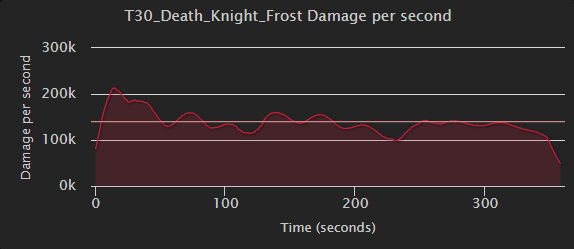

# 10.1 Breath of Sindragosa Guide for Frost Death Knights
By Khazakdk

## Introduction
### Who is this guide for?
This guide is targeted towards players who are newer to the spec or long time Frost players who have avoided the Breath of Sindragosa build.

### What does this guide cover?
This guide will primarily focus on Breath of Sindragosa gameplay, with smaller portions focused on gear and talents.  Other guides and resources sufficiently cover those subjects.  My main focus here will be teaching how to actually play the spec in PvE content with the aim of reducing some misconceptions about the builds.  Many players feel that BoS is either a 1 button playstyle that is too boring or is too punishing on the player for dealing with mechanics.  

### Who am I?
My name is Khazak, Acherus moderator and a Death Knight main since I started playing in 5.4.  Some notable contributions include working on the DK simc module and writing the Frost and Unholy modules for WoWAnalyzer.     

## Talents
### Death Knight class talents

This is the build you will be using the vast majority of the time in raid content.  In order to achieve the pathing needed to pick up all the throughput you will lose nearly all flexibility in the class tree.  There are a few points where you can flex that I will highlight.

The biggest flex point is if you are doing content that has no significant magic damage, making AMZ an unused button.  This opens up Blinding Sleet, Coldthirst, and Improved Death Strike.
- Blinding Sleet is a good pickup in all keys, and can be taken in raid if the fight calls for it.
- Coldthirst is the first thing you look to take if you drop AMZ.
- Improved Death Strike is very strong in the right situations.  It’s primary benefit to Frost is the rp cost reduction.  I would only look at this in m+.

With these points considered, I default to the following class tree for Frost M+

### Frost spec talents

This is a relatively rigid tree.  There are some essential nodes we must path to, I have marked those in green.  We are left with essentially 3 non mandatory points, Fatal Fixation, and 2/2 Bonegrinder.  Breath has only a few places it can really spend these.
- Chill Streak + one of its upgrades.  In 2T content, this is hands down the best thing you can pick.  The problem is there is a severe lack of 2T content available to us right now.  Frostwyrm’s Fury will scale better into higher target counts, and CS is useless in ST.
- Frostwhelp’s Indignation.  Solid if you can hit 4-5 targets with each pillar.  Unfortunately a bit too expensive at 2 points to justify taking right now.
- Frostwyrm’s Fury.  One point into FWF is better than 2/2 Bonegrinder in multi target content.  Very solid and usually the first thing you look to swap to.
- 2/2 Bonegrinder.  Bonegrinder is a bit of a one point wonder, as the crit effect does not scale with points spent, only the frost damage does.  In multi target situations you will usually look to drop a point here for something like FWF.

## Why play Breath?
Breath’s uniqueness comes from its dynamic gameplay.  Instead of being a scripted cooldown, your rotation priority changes based on your resources while BoS is rolling.  Our goal during BoS is to extend it as long as possible without otherwise sacrificing throughput.  This is done by generating Runic Power as efficiently as possible, which is done by managing Runes well.  The dynamic element is primarily enabled by the passive Runic Empowerment giving BoS a powerful feedback loop.  By spending Runic Power off the gcd, BoS is able to significantly increase its Rune regeneration rate, which will in turn generate more Runic Power to fuel BoS.  BoS is also able to freely cleave onto other targets while not sacrificing any priority target damage, something that is typically very valuable in progression raiding.   

## Why not to play Breath?
Breath is currently in something of an identity crisis.  For years it performed at its best when it lasted 25-45 seconds.  Having a high impact 2 minute cooldown with a dynamic playstyle attracted players to the spec as it enabled an interesting playstyle where players could look at a fight and figure out when to most effectively use cooldowns.  Currently, BoS does not fit that identity.  It is a spec that demands constant uptime, using CDs almost as soon as you can, and has one of the highest amounts of RNG of all the DPS specs.  This makes BoS often feel out of the player’s control, which most players find frustrating.     
## Abilities and Rotation
### Priority list inside BoS
- Remorseless Winter
- Howling Blast with Rime if RP > 45 OR RP > 37 with RotFC
- Horn of Winter if you have less than 2 Runes and will not waste RP
- Obliterate.  If PoF is up, then use immediately otherwise try to avoid RP waste
- Howling Blast or DnD if you have 1 rune and less than 36 rp to try (Very minor, gets you an extra tick)
- Arcane torrent (With less than 60 RP)
### Priority list outside BoS
- Frost Strike to maintain IT/UF
- Remorseless Winter
- Frost strike if you won’t waste a Rime or KM proc
- Rime if you wont waste KM
- Obliterate with KM
- Obliterate
- Frost strike

## Resource Cooldowns
Frost has 4 major resource cooldowns: Empower Rune Weapon, Horn of Winter, Anti-magic Shell, and Anti-magic Zone.  Understanding when to use them so as to not waste any of them is key to doing well on breath.
- Horn of Winter is the simplest.  While instead Breath, you use it when you have no Runes, i.e. you cannot press Obliterate and you have no Rime procs to consume with RotFC.
- Next easiest is AMZ, as this is usually assigned.  If not assigned, you want to use it when your raid will take enough magic damage to use most of the AMZ.  If given the choice of multiple points where this is true, then pick the spot that best matches where your resources will hit a lull.  For example, on mythic Raszageth it was usually best to AMZ on the second Hurricane Wing cast around 1:15 as the first cast would often cause RP to overcap and the third cast would necessitate using another resource cd early to still have breath up.  
- AMS is usually straightforward to use.  To properly use it, you need to have some knowledge of what mechanics in the fight do magic damage.  Your goal is to use AMS close to off cooldown so you don’t lose casts, but also make sure you get a good use.  For the last 2 tiers we have had magic damage heavy content so it has become standard to get a full use out of AMS.
- Lastly, ERW.  This is the hardest cooldown to pin down exactly when to use.  While the resources this grants are nice, its main benefit is the haste.  To put it into context, if breath is close to dying, ERW is just 15 RP on activation with another 15 RP on the next tick in 5 seconds.  Because of this, you want to use ERW a bit before you start to really run dry on resources.  The **sim** answer to this is to use ERW when you have less than 70 RP and less than 3 Runes.  However, on some fights you can anticipate having to deal with a mechanic or heavy movement during your breath.  In those situations, it is often advantageous to hold ERW and use it shortly before the mechanic to bolster your resources.  My advice would be to start with the sim timings, and then adjust ERW if you hit a sticking point.  Or, to look at some logs beforehand with a tool like lorrgs.io.  Now to turn to the next topic, what to do with the second charge?  In most situations, you should be using your first ERW with your first Pillar/Breath on pull with Bloodlust.  Below I have presented my evidence for this.  I need to stress the importance of this erw usage being lined up with lust.    

| Lust + AMS/AMZ RP |
| :----------------------: |
|  |
|  | Damage curve for default APL |   
|  | Damage curve for APL holding ERW |

There’s an obvious difference here.  Holding ERW is causing a noticeable dip in the burst peak at the start of the fight.  Stacking haste buffs is very potent, as anyone who’s played Unholy is aware and the same applies to frost.  The extra haste in the lust window lets you cycle more GCDs in your pillar to stack it higher, and makes rolling your GS stacks into a new RW more consistent.

| No Lust + AMS/AMZ RP |
| :----------------------: |
|  |
|  | Damage curve for default APL |   
|  | Damage curve for APL holding ERW |
   

Without lust on pull, the difference becomes slight.  This would line up with a fight like Echo of Neltharion, where between the unlusted pull and frequent movement, you would want to save ERW.

| No Lust + No AMS/AMZ RP |
| :----------------------: |
|  |
|  | Damage curve for default APL |   
|  | Damage curve for APL holding ERW |

Almost not worth discussing this, I have included just to show the opposite of the claim, that without lust it is not worth using ERW early.

| Lust + No AMS/AMZ RP |
| :----------------------: |
|  |
|  | Damage curve for default APL |   
|  | Damage curve for APL holding ERW |

One final example just to emphasize that most of the gain is from stacking haste cooldowns.

## Stats
Before going any further, SIM YOURSELF.  Numerous factors go into the value of each stat and trying to come up with a value is best left to using a computer to solve for each particular situation.  Sometimes a general trend can be found, but this is not always the case.  I will give the stats in no particular order 
#### Mastery
Simply increases our frost damage done.  This only affects spells specific to us and will not increase frost damage from items or other effects that originate outside of the spec itself.  It is often a better stat to pick up in AoE since our primary multi target spells are frost damage.  We prefer mastery to versatility because of how mastery points work.  It takes 180 mastery rating to gain 1 mastery point, which converts to 2% mastery on your sheet.  Versatility takes 205 rating to gain 1% damage.
#### Critical Strike
Does what it says on the tin but has some extra benefits for Frost.  It’s primary extra benefit is more crit gives more Killing Machine procs, and this means more chances for Murderous Efficiency procs for Runes.  In Aberrus, the tier set amplifies our crits making it more valuable than it already was.  This makes BoS build tend to want as much crit as it can get.
#### Haste
Speeds up your auto attacks, GCD, and Rune regeneration rate.  The primary benefit you will see is the sped up GCD.  Rune regeneration is determined by (10 / 1 + haste).  So with 10% haste we get a rune cooldown of (10 / 1 + .10) = 9.09s.  This same formula governs GCD however.  As we get Runes back faster, we can spend them faster.  To illustrate this, I ran two sims, one with 1000 haste and one with 6000 
Can you guess which one has 6000?  Its the first one.  Being able to cycle resources so quickly leads to a lot of waiting from either being out of runes or full on RP.  This point isn’t to dissuade or downplay haste, just to dispel the rumor that DK has a lot of downtime without haste.  Haste’s main benefit to Frost is the faster GCD.  I want to highlight two main benefits from this.  First, it stacks Pillar of Frost’s strength bonus higher and builds Enduring Strength.  The other is it builds GS stacks faster and increases our ability to carryover stacks to the next cast of RW.  

#### Versatility
Not much to stay here.  It’s a boring and expensive stat.

## Gearing
Sim yourself.  All gearing can and should be handled by using Top Gear and Droptimizer to see what’s going to be good for your specific character.  I will briefly cover what you’re looking for in terms of crafting your sparks and if you need to insist on anything being good for you to your loot council:
Craft boots and belt, put shadowflame patch on them.
Craft weapon
Craft ring

Class trinket and OCE are very good for us.

## Consumes
Phial of Corrupting Rage is incredibly good for us.  Do not let your healers bully you into vers.  Dropping this Phial would like taking off a mythic ilvl weapon and replacing it with a normal ilvl weapon.  Buzzing Rune for your temporary enchant.  Sim yourself for gems and enchants.  Runeforges are Fallen Crusader and Hysteria.  
  
